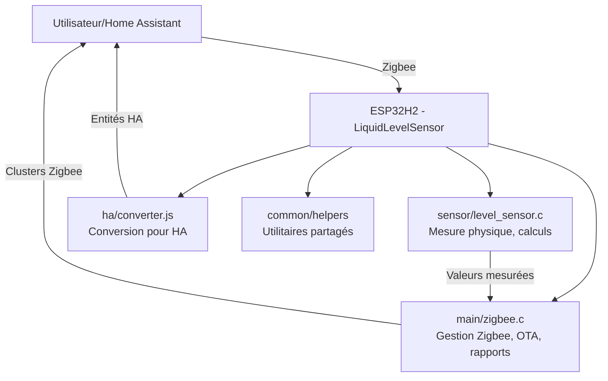

# Architecture et Implémentation du Projet LiquidLevelSensor

## Introduction

Le projet **LiquidLevelSensor** est un capteur IoT (Internet des Objets) basé sur l'ESP32H2, conçu pour mesurer le niveau de liquide dans un réservoir d'eau et rapporter ces informations via Zigbee à un système de domotique comme Home Assistant. Il calcule des volumes clés (total, stockage, rétention) et supporte les mises à jour Over-The-Air (OTA).

**Objectif métier** : Surveiller en temps réel le niveau d'eau dans des réservoirs pour prévenir les pénuries ou débordements, typiquement dans des contextes agricoles, industriels ou domestiques.

**Technologies principales** :
- **ESP-IDF** : Framework de développement pour ESP32.
- **Zigbee** : Protocole de communication sans fil.
- **Capteur** : A02YYUW (capteur à ultrasons waterproof).

## Architecture Générale

Le projet suit une architecture modulaire et embarquée, optimisée pour la basse consommation et la fiabilité.

### Vue d'Ensemble
- **Plateforme matérielle** : ESP32H2 (microcontrôleur basse puissance avec support Zigbee intégré).
- **Communication** : Zigbee pour l'intégration réseau ; UART pour le capteur physique.
- **Structure logicielle** : Basée sur FreeRTOS (système d'exploitation temps réel) pour gérer les tâches concurrentes.
- **Modèle de déploiement** : Appareil autonome avec mises à jour OTA.

### Diagramme d'Architecture


## Composants Principaux

### 1. Module Main (main/)
- **Fichiers** : `zigbee.c`, `zigbee.h`
- **Responsabilités** :
  - Initialisation du réseau Zigbee.
  - Gestion des clusters Zigbee pour rapporter les valeurs (niveau, volumes).
  - Support OTA : Téléchargement et application de mises à jour logicielles via Zigbee.
- **Implémentation** :
  - Utilise des bibliothèques ESP-Zigbee pour les clusters personnalisés.
  - Callback pour mettre à jour les attributs Zigbee avec les valeurs du capteur.
  - Intervalle de requête OTA : 1 minute.

### 2. Module Sensor (sensor/)
- **Fichiers** : `src/level_sensor.c`, `include/level_sensor.h`
- **Responsabilités** :
  - Interface avec le capteur A02YYUW via UART.
  - Mesure de la distance (profondeur) et calcul des volumes.
- **Implémentation** :
  - Configuration UART : Baud rate 9600, pins GPIO 10 (trigger) et 11 (echo).
  - Calculs :
    - Distance = (data[1] << 8) + data[2] (en cm, max 450 cm).
    - Volume total = (profondeur / profondeur_max) * volume_total_config.
    - Volume stockage = min(volume_total, volume_stockage_config).
    - Volume rétention = max(0, volume_total - volume_stockage_config).
  - Gestion d'erreurs : Timeouts, checksums pour valider les données UART.

### 3. Module Home Assistant (ha/)
- **Fichiers** : `external_converters/llsensor.001-converter.js`
- **Responsabilités** :
  - Convertir les messages Zigbee bruts en entités HA (ex. : capteurs, jauges).
- **Implémentation** :
  - Définit un cluster personnalisé "waterLevelMeasurement" (ID 0xff00).
  - Attributs : currentLevel, totalVolume, storageVolume, retentionVolume, etc.
  - Utilise zigbee-herdsman-converters pour l'intégration.

### 4. Modules Utilitaires
- **common/** : Code partagé (ex. : configurations communes).
- **helpers/** : Fonctions d'aide (ex. : conversions, logs).
- **esp_idf_lib_helpers/** : Wrappers pour ESP-IDF.

## Modèles de Données

### Structures de Données
- **level_sensor_cfg_t** (Configuration) :
  - `max_depth` : Profondeur maximale du réservoir (cm).
  - `min_depth` : Profondeur minimale (cm).
  - `total_volume` : Volume total (L).
  - `storage_volume` : Volume de stockage (L).
  - `retention_volume` : Volume de rétention (L).

- **level_sensor_val_t** (Valeurs mesurées) :
  - `depth` : Profondeur actuelle (cm).
  - `total_volume` : Volume total calculé (L).
  - `storage_volume` : Volume de stockage (L).
  - `retention_volume` : Volume de rétention (L).
  - `total_volume_percentage` : Pourcentage (optionnel).

### Clusters Zigbee
- **Cluster personnalisé** : "waterLevelMeasurement" (0xff00).
- **Attributs** :
  - 0x0001 : currentLevel (niveau actuel).
  - 0x0004 : totalVolume.
  - 0x0005 : storageVolume.
  - 0x0006 : retentionVolume.
  - Etc. (voir converter.js pour la liste complète).

## Implémentation Technique

### Cycle de Vie
1. **Initialisation** : Configuration matérielle (GPIO, UART), connexion Zigbee.
2. **Mesure** : Trigger du capteur, lecture UART, calculs.
3. **Rapport** : Envoi des valeurs via Zigbee à HA.
4. **OTA** : Vérification périodique de mises à jour.

### Gestion des Tâches (FreeRTOS)
- Tâche principale : Boucle infinie pour mesures et rapports.
- Tâche OTA : Gestion des téléchargements en arrière-plan.

### Sécurité et Fiabilité
- **Checksums** : Validation des données UART.
- **Timeouts** : Évitement des blocages (ex. : 6000 ms pour ping).
- **Logs** : Utilisation d'ESP_LOG pour débogage (niveaux INFO, DEBUG).

### Dépendances
- **ESP-IDF** : Version compatible avec ESP32H2.
- **Bibliothèques** : esp-zigbee-lib, esp-zboss-lib.
- **Externe** : zigbee-herdsman-converters (pour HA).

## Schéma de Câblage

Voici le schéma de connexion entre l'ESP32H2 et le capteur A02YYUW :

```
ESP32H2                     A02YYUW (Capteur)
--------                     -------------
GPIO 10 (TX, UART1)  ----->  RX
GPIO 11 (RX, UART1)  ----->  TX
3.3V / 5V (VCC)      ----->  VCC (selon le modèle, 3.3V ou 5V)
GND                     ----->  GND
```

**Notes** :
- Assurez-vous que l'alimentation (VCC) correspond aux spécifications du capteur (généralement 3.3V-5V).
- Le baud rate UART est fixé à 9600 bauds.
- Le capteur A02YYUW est waterproof, idéal pour environnements humides.

## Configuration et Utilisation

### Configuration Initiale
- **sdkconfig** : Paramètres ESP-IDF (Zigbee, UART, etc.).
- **Partitions** : partitions.csv pour la mémoire flash.
- **OTA** : Index des mises à jour dans /share/ota/iot/ota/ota_index.json.

### Utilisation
1. Flasher le firmware sur ESP32H2.
2. Configurer le réseau Zigbee.
3. Intégrer dans HA via le converter.
4. Surveiller les rapports en temps réel.

### Build et Déploiement
- **Commandes** : Utiliser ESP-IDF tools (idf.py build, flash, monitor).
- **OTA** : Via Zigbee, avec index JSON.

## Limites et Évolutions
- **Limites** : Calculs linéaires (pas pour réservoirs complexes) ; dépendance Zigbee.
- **Évolutions** : Alertes, multi-capteurs, intégration Wi-Fi, IA pour prédictions.

---

*Document généré le 14 mars 2026. Pour plus de détails, consulter les fichiers source.*